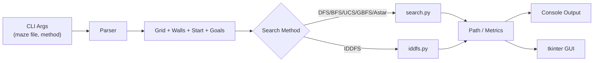

# RoboNav — Tree-Based Search for Grid Navigation (Python)


A Python project that solves **robot navigation on a grid** using classic **tree/graph search** algorithms. It includes a **tkinter GUI** that visualizes exploration step-by-step and a CLI that prints actions, nodes expanded, run time, memory, and an ASCII maze.

## Table of Contents
- [Features](#features)
- [Algorithms](#algorithms)
- [Architecture](#architecture)
- [Project Structure](#project-structure)
- [Data Structures](#data-structures)
- [CLI](#cli)
- [GUI](#gui)
- [Examples](#examples)
- [Testing](#testing)
- [Performance Notes](#performance-notes)
- [Roadmap](#roadmap)
- [Credits](#credits)
- [License](#license)

## Features
- **Six algorithms** out of the box:
  - **DFS** (depth-first, LIFO stack)
  - **BFS** (breadth-first, FIFO queue; shortest path in steps)
  - **IDDFS** (iterative deepening; DFS memory with BFS completeness)
  - **GBFS** (greedy best-first; heuristic only)
  - **A\*** (cost + heuristic; optimal with an admissible heuristic)
  - **UCS** (uniform cost; optimal on weighted graphs, no heuristic)
- **Visual exploration** with **tkinter** (visited, frontier, final path).
- **ASCII summary** in the terminal (actions, counts, timings, memory).
- **Modular, OOP design** for easy extension and experimentation.

## Algorithms
| Method | Frontier | Evaluation | Optimal? | Notes |
|------:|:--------:|:-----------|:--------:|:------|
| DFS | Stack | Depth first | ✖ | Low memory per step; may miss shortest path |
| BFS | Queue | Layer order | ✔ | Shortest number of moves; higher memory |
| IDDFS | Depth limit | Iterative deepening | ✖/✔ | BFS completeness with DFS-like memory |
| GBFS | Priority queue | `h(n)` | ✖ | Fast when heuristic is informative |
| A\* | Priority queue | `g(n)+h(n)` | ✔ | Great balance of speed and optimality |
| UCS | Priority queue | `g(n)` | ✔ | No heuristic; can explore widely |

**Heuristic**: Manhattan distance is used for informed methods (GBFS, A\*).

## Architecture
The system parses a maze, prepares a start/goal set, then dispatches to the chosen search. The GUI listens for state changes and paints the grid.



## Project Structure
```text
/src
  main.py             # Entry point: args, dispatch, metrics/printing
  maze.py             # Grid model, parsing, validity, neighbors()
  node.py             # Node(state, parent, action, g, h)
  search.py           # DFS, BFS, GBFS, A*, UCS (shared frontier logic)
  iddfs.py            # Iterative deepening (separate due to recursion)
  gui.py              # tkinter visualization (cells, colors, updates)
  test_maze.py        # unittest suite for paths/goals/flows
```

## Data Structures
- **Node** — state tuple `(row, col)` + `parent` + `action` + optional `g/h`.
  ```python
  class Node:
      def __init__(self, state, parent=None, action=None, g=0, h=0):
          self.state = state
          self.parent = parent
          self.action = action
          self.g = g
          self.h = h
  ```
- **Frontier** — implementation depends on the algorithm:
  - DFS: Python list as **stack**
  - BFS: Python list as **queue**
  - GBFS/A\*/UCS: **heapq** priority queue with `(priority, node)`
- **Explored set** — `set()` of visited states to avoid revisits.
- **Maze** — dimensions, `walls`, `start`, `goals`, `neighbors(state)`.

## CLI
### Install
```bash
python -m pip install tk   # tkinter (Windows/macOS)
# or on Debian/Ubuntu:
sudo apt-get install python3-tk
```

### Run
```bash
# syntax
python3 main.py <maze.txt> <method>

# examples
python3 main.py RobotNav_Test.txt bfs
python3 main.py RobotNav_Test.txt astar
python3 main.py RobotNav_Test.txt iddfs
```

**Method keys**: `dfs`, `bfs`, `gbfs`, `astar`, `ucs`, `iddfs`.

Output includes:
- **Actions** (e.g., `['right','right','up', ... ]`)
- **Nodes expanded**
- **Path length**
- **Execution time**
- **Memory usage**
- **ASCII maze** with the discovered path

## GUI
The **tkinter** window opens automatically:
- Colors distinguish **walls**, **start**, **goals**, **visited**, **frontier**, **solution**.
- Cells update live as the search progresses.
- Works out-of-the-box—no extra setup required.

> Tip: large mazes render fine, but very dense maps can repaint often—run headless (CLI only) if benchmarking.

## Examples
CLI excerpts you might see (illustrative):
```text
Nodes expanded: 20
Path length: 10
Time: 2.381s
Memory: 39.10 KB

ASCII Maze:
S..#...
..##..G
..**..*
...**.*
```

GUI snapshots to include in your repo:
- `images/gui_bfs.png`
- `images/gui_astar.png`
- `images/ascii_summary.png`

## Testing
Automated **unittest** coverage:
- Verifies each solver **finds a path** when reachable.
- Ensures the **goal appears** in the returned path.
- Uses generated temporary mazes for isolation.

Example sketch:
```python
def test_astar_reaches_goal(self):
    maze = sample_maze()
    path, stats = astar(maze)
    self.assertTrue(path)
    self.assertEqual(path[-1].state, maze.goal)
```

## Performance Notes
- **A\*** consistently balances **few expansions**, **short paths**, and **reasonable memory** when Manhattan distance matches the grid’s movement model.
- **BFS/UCS** return shortest paths (steps / cost) but can use more memory/time.
- **GBFS** is fast when the heuristic is informative, but not optimal.
- **DFS/IDDFS** keep memory low per step; **IDDFS** improves completeness but repeats work on deep trees.

## Roadmap
- Weighted/epsilon **A\***, **bidirectional** search.
- **Diagonal moves** with octile distance.
- **Multiple goals** and dynamic obstacles.
- Headless benchmark harness + CSV metrics export.
- Optional **Roomy GUI** controls (speed, pause, step).

## Credits
- Python stdlib: **tkinter**, **heapq**.
- Coursework and references on uninformed/informed search and heuristics.
- Report figures and code snapshots that informed this README.

## License
MIT
